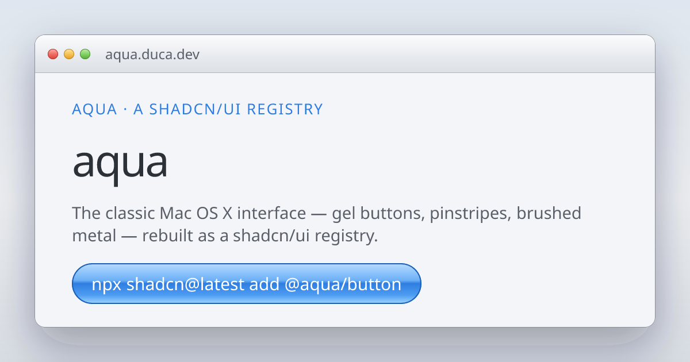

<p align="center">
  
</p>

<h1 align="center">Aqua</h1>

<p align="center">
  The classic Mac OS X interface — gel buttons, pinstripes, brushed metal — rebuilt as a <a href="https://ui.shadcn.com">shadcn/ui</a> registry.
</p>

<p align="center">
  <a href="https://aqua.duca.dev">aqua.duca.dev</a> ·
  <a href="https://aqua.duca.dev/docs/introduction">Docs</a> ·
  <a href="https://aqua.duca.dev/demo/mail">Mail demo</a> ·
  <a href="https://aqua.duca.dev/demo/chat">Chat demo</a>
</p>

---

Aqua recreates the Apple interface of 2000–2007 as accessible React components: Radix primitives underneath, Tailwind CSS gel gradients on top. Like everything in the shadcn ecosystem, it is not a package you import — components are copied into your project as open code. Change anything, own everything.

## Quick start

Register the namespace in your `components.json`:

```json
{
  "registries": {
    "@aqua": "https://aqua.duca.dev/r/{name}.json"
  }
}
```

Install the theme, then add components:

```bash
npx shadcn@latest add @aqua/theme
npx shadcn@latest add @aqua/button @aqua/tabs @aqua/select
```

Components import from your own project:

```tsx
import { Button } from "@/components/ui/button"

<Button>gorgeous</Button>
```

## Components

**Core** — Alert, Avatar, Badge, Button, Checkbox, Code Block, Cursor, Dialog, Dropdown Menu, Input, Label, Loader, Progress, Radio Group, Select, Slider, Switch, Tabs, Textarea, Toast, Tooltip

**Signature** — the pieces that only make sense in this design language:

- **Window** — brushed metal chrome with traffic lights
- **Dock** — magnifying icons, haloed labels, running indicators
- **Chat Bubble** — iChat gradient bubbles with sculpted tails
- **iPod** — white shell, LCD screen, a working click wheel
- **Cursor** — wrap your app and get the era arrow, hand and I-beam back

Every component is themable through a single CSS variable:

```css
:root {
  --aqua-accent: #e02f6b; /* strawberry */
}
```

The gel gradients, edges and focus rings are derived with `color-mix`, so one line rethemes everything — globally or scoped to any subtree.

## For AI agents

Aqua ships [`/llms.txt`](https://aqua.duca.dev/llms.txt) and [`/llms-full.txt`](https://aqua.duca.dev/llms-full.txt) with complete setup and per-component usage, and every docs page has a **Copy AI prompt** button that produces a ready-to-paste instruction for your agent of choice.

## Development

This repository is the registry and its documentation site (Next.js 15, Tailwind v4, Bun).

```bash
bun install
bun run dev            # docs site on localhost:3000
bun run registry:build # rebuild public/r/*.json from registry.json
```

Component sources live in `registry/aqua/ui/`. The docs live in `components/docs-content.tsx`.

## Credits

Designed and built by [Igor Duca](https://duca.dev) ([@ducaswtf](https://x.com/ducaswtf)). The original design language belongs to Apple — this is a tribute, not an affiliation.

## License

[MIT](LICENSE)
